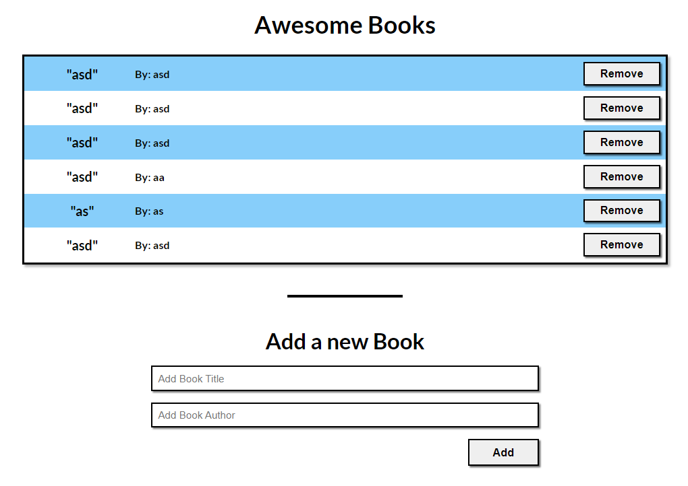
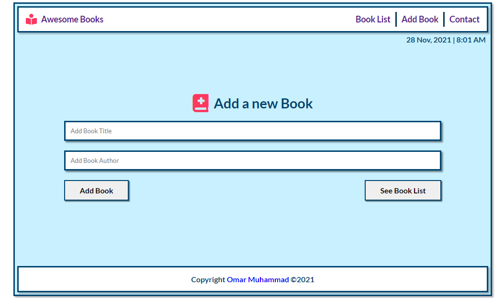
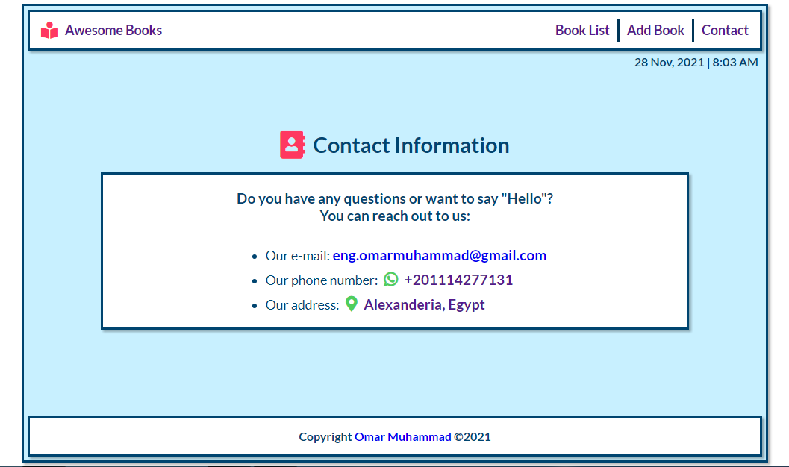

# Awesome Books

**What I did in this project:**

1.  Add book class with constructor.
2.  Include add and remove methods in the class.
3.  Make these methods to add and remove books data to DOM and local storage.
4.  Add some basic styling and check linters errors.

# Site Live Demo

[Live Demo Link](https://omar-muhamad.github.io/Awsome-Books/)

# Site Screenshots

## Built With

- HTML.
- CSS.
- JavaScript.
- Linters.

## How to run locally:

1. Clone the project using git-bash or Githup Desktop.
2. Open the project folder with VSCode or any Editor.
3. Open index.html file and open with live server.
4. If you don't have live server extension install it
   or open index.html manually from your file explorer.

## Authors

👤 **Omar Muhammad**

- GitHub: [@Omar-Muhamad](https://github.com/Omar-Muhamad)
- Twitter: [@Eng_OmarMuhamad](https://twitter.com/Eng_OmarMuhamad)
- LinkedIn: [@eng-omarmuhammad](https://www.linkedin.com/in/eng-omarmuhammad/)

## Show your support

Give a ⭐️ if you like this project!
