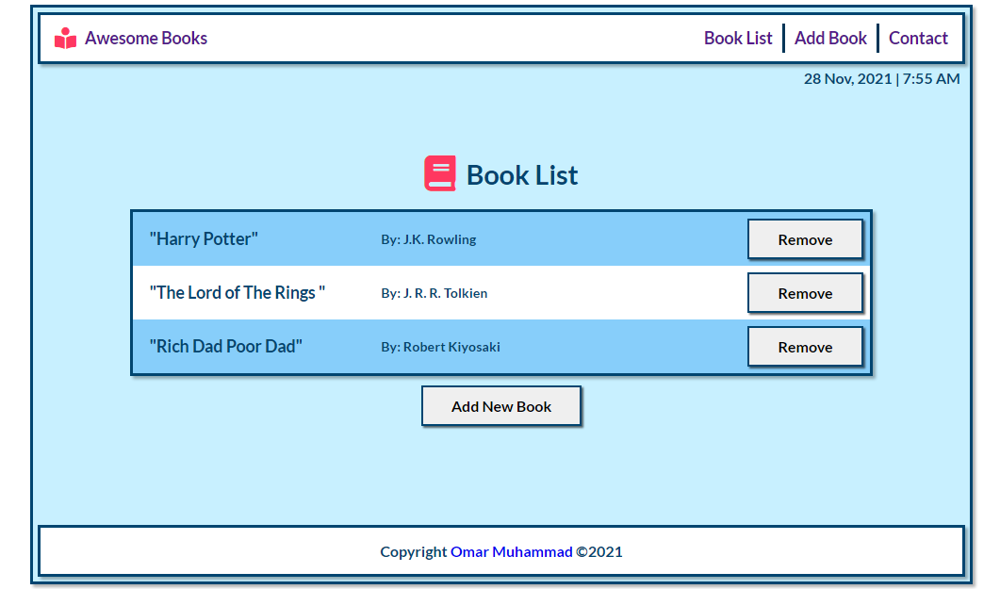

# Awesome Books

**What I did in this project:**

1.  Add book class with constructor.
2.  Include add and remove methods in the class.
3.  Make these methods to add and remove books data to DOM and local storage.
4.  Add some basic styling and check linters errors.

# Site Screenshots

## Built With

- HTML.
- CSS.
- JavaScript.
- Linters.

## Authors

👤 **Omar Muhammad**

- GitHub: [@Omar-Muhamad](https://github.com/Omar-Muhamad)
- Twitter: [@Eng_OmarMuhamad](https://twitter.com/Eng_OmarMuhamad)
- LinkedIn: [@eng-omarmuhammad](https://www.linkedin.com/in/eng-omarmuhammad/)

## Show your support

Give a ⭐️ if you like this project!
